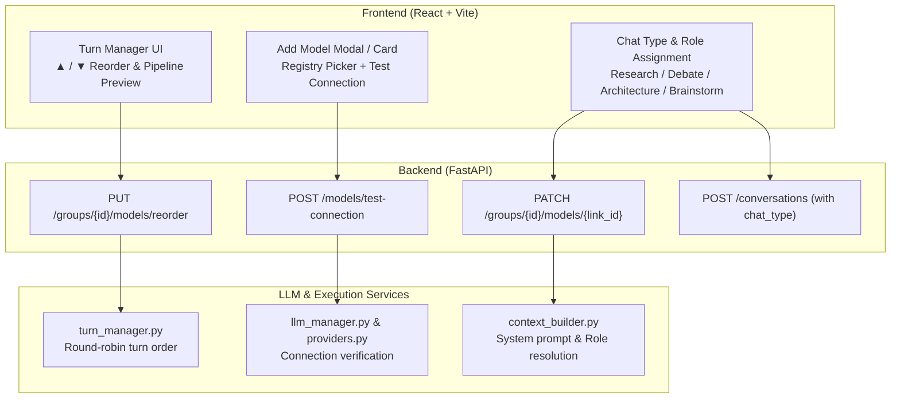

# Implementation Plan: LLM Turn Management, Diagnostics for Adding LLMs, and Role Assignment by Chat Type

This plan addresses three key capabilities requested for the Multi-LLM Group Chat system:
1. **Turn Management & Turn Order Customization**: Allow users to dynamically reorder LLM turn order (Move Up / Down / Reorder), enable/disable participants, remove models, and preview the turn execution sequence and next speaker.
2. **Improved LLM Addition with Exact Issue Diagnostics**: Provide a streamlined way to add LLMs (either from existing model registry or new provider configuration), live connection testing ("Test Connection" button) before adding, input validation, and clear error diagnostics explaining exactly why a model failed to add or connect.
3. **Role Assignment for Different Chat Types via Prompting**: Support specialized chat modes (Research, Formal Debate, Software Architecture, Creative Brainstorming, Custom) where each LLM in the group can be assigned and prompted with a specific role/persona, customizable system prompts, and role indicators on discussion turns.

---

## User Review Required

> [!IMPORTANT]
> **Database Schema Enhancement**:
> We will add an optional `chat_type` column (e.g. `"research"`, `"debate"`, `"architecture"`, `"brainstorm"`, `"custom"`, default: `"research"`) to the `conversations` table.
> For SQLite backwards compatibility without breaking existing data, we will apply safe conditional schema migration or column reflection.

> [!TIP]
> **Live Connection Verification**:
> When adding or testing a model, the backend will send a minimal ping prompt (`max_tokens=5`, 10s timeout) through the chosen provider and report exact latency or detailed HTTP/API failure reasons (e.g. invalid API key, model not found, local Ollama server unreachable, rate limit).

---

## Proposed Changes



---

### 1. Turn Management & Reordering

#### [MODIFY] [backend/app/schemas.py](file:///d:/Python%20projects/Multi-LLM%20group%20chat/backend/app/schemas.py)
- Add `GroupModelsReorderRequest`:
  ```python
  class GroupModelsReorderRequest(BaseModel):
      ordered_link_ids: list[int]
  ```
- Add `role_name: str | None = None` to `TurnOut` to expose the role or persona assigned to the model during that turn.
- Add `chat_type: str = "research"` to `ConversationCreate` and `ConversationOut`.

#### [MODIFY] [backend/app/routers/groups.py](file:///d:/Python%20projects/Multi-LLM%20group%20chat/backend/app/routers/groups.py)
- Add `PUT /groups/{group_id}/models/reorder`:
  - Accepts `GroupModelsReorderRequest`.
  - Validates that all IDs belong to `group_id`.
  - Assigns `turn_order = 0, 1, 2, ...` in a single transaction.
  - Returns the sorted list of `GroupModelOut`.
- Improve error handling in `add_model_to_group`:
  - Return informative message if model is already linked to the group (`"Model '{name}' is already assigned to this group."`).

#### [MODIFY] [frontend/src/api.js](file:///d:/Python%20projects/Multi-LLM%20group%20chat/frontend/src/api.js)
- Add API methods:
  - `reorderGroupModels(gid, orderedLinkIds)` -> `PUT /groups/${gid}/models/reorder`
  - `removeGroupModel(gid, linkId)` -> `DELETE /groups/${gid}/models/${linkId}`
  - `updateGroupModel(gid, linkId, body)` -> `PATCH /groups/${gid}/models/${linkId}`
  - `testModelConnection(body)` -> `POST /models/test-connection`

#### [MODIFY] [frontend/src/App.jsx](file:///d:/Python%20projects/Multi-LLM%20group%20chat/frontend/src/App.jsx)
- **Turn Order Controls**:
  - Add **▲ Move Up** and **▼ Move Down** buttons next to each model in the group.
  - Add **Remove (✕)** button to unlink a model from the group.
  - Add an order badge (`#1`, `#2`, `#3`) reflecting exact speaking sequence.
  - Highlight the **"Next to Speak"** model based on the conversation's `current_turn % enabled_models.length`.
  - Add a **Visual Turn Pipeline**:
    `[Turn 1: GPT-4o] ➔ [Turn 2: Claude 3.5] ➔ [Turn 3: Gemma 2] ➔ ↻ Repeat`

---

### 2. Adding an LLM with Diagnostics & Verification

#### [MODIFY] [backend/app/llm/manager.py](file:///d:/Python%20projects/Multi-LLM%20group%20chat/backend/app/llm/manager.py) & [backend/app/llm/providers.py](file:///d:/Python%20projects/Multi-LLM%20group%20chat/backend/app/llm/providers.py)
- Add connection test utility `verify_model_connection(model_config)`:
  - Performs a lightweight test generation (`"Reply with 'OK'"`).
  - Measures latency in milliseconds.
  - Catches provider-specific exceptions:
    - HTTP 401 / 403: "Authentication failed. The provided API key is invalid or unauthorized."
    - HTTP 404: "Model '{model_name}' was not found on provider '{provider}'. Check the model ID spelling."
    - HTTP 429: "Rate limit exceeded or quota exhausted for this API key."
    - ConnectError / Timeout: "Could not connect to {base_url}. Ensure the service (e.g. Ollama, LM Studio) is running and reachable."
    - Missing key: "API key is required for provider '{provider}' and none is configured in .env or model credentials."
  - Returns structured diagnostics: `{ ok: bool, latency_ms: float, error_code: str | None, message: str }`.

#### [MODIFY] [backend/app/routers/groups.py](file:///d:/Python%20projects/Multi-LLM%20group%20chat/backend/app/routers/groups.py)
- Add endpoint `POST /models/test-connection`:
  - Accepts `LLMModelCreate` or partial config.
  - Calls `verify_model_connection` and returns the diagnostic result.

#### [MODIFY] [frontend/src/App.jsx](file:///d:/Python%20projects/Multi-LLM%20group%20chat/frontend/src/App.jsx)
- **Redesigned "Add Model to Group" section**:
  - Two convenient tabs:
    1. **"Pick Existing Model"**: Dropdown of models already registered in the database, with an "Add to Group" button. Shows immediate feedback if already in group.
    2. **"Create & Add New Model"**: Form to define a new model.
  - **Provider helper dropdown**:
    - Select provider (`codecraft`, `openai`, `anthropic`, `gemini`, `openrouter`, `local`).
    - Auto-suggests known model names (e.g. `gemma-2-2b`, `gpt-4o-mini`, `claude-3-5-sonnet-latest`, `gemini-1.5-flash`, `llama3`).
    - Smart hints for base URL and API key fallbacks.
  - **"Test Connection" button**:
    - Tests the connection before adding.
    - Shows a live testing spinner.
    - Displays clear success alert (`"✓ Connection successful (latency: 180ms)"`) or highlighted error alert (`"✗ Connection failed: [HTTP 401] Invalid API Key"`).
  - **Exact issue display**:
    - If user attempts to add an invalid or incomplete model, or if an API error occurs, shows a clear diagnostic box stating the exact issue (missing fields, duplicate link, provider error) instead of failing silently.

---

### 3. Role Assignment for Different Chat Types via Prompting

#### Chat Type & Role Presets Catalog
We will establish structured templates for common collaborative group chat types:

| Chat Type | Key Roles & Prompting Directives |
| :--- | :--- |
| **🔬 Research & Analysis** | • **Lead Researcher**: Hypothesizes, guides overall investigation.<br/>• **Skeptic / Peer Reviewer**: Challenges assumptions, finds logical fallacies and edge cases.<br/>• **Empirical Specialist**: Supplies concrete domain mechanisms, equations, or scientific evidence.<br/>• **Synthesizer**: Consolidates agreed findings and defines unresolved questions. |
| **⚔️ Formal Debate** | • **Affirmative / Proponent**: Builds arguments in favor of the thesis.<br/>• **Negative / Opponent**: Rebuts arguments and presents counter-positions.<br/>• **Cross-Examiner**: Probes both sides with critical questions and fact-checks.<br/>• **Neutral Moderator / Judge**: Evaluates argument strength and summarizes debate points. |
| **💻 Code & Architecture** | • **System Architect**: Designs module structure, interfaces, scalability.<br/>• **Security & Reliability Auditor**: Scans for vulnerabilities, race conditions, edge cases.<br/>• **Performance Specialist**: Analyzes latency, memory, database query costs.<br/>• **Reviewer / Pragmatist**: Ensures code readability, maintainability, and implementation steps. |
| **💡 Brainstorming & Strategy** | • **Visionary Ideator**: Unconstrained creative concept generator.<br/>• **Customer / User Advocate**: Evaluates user friction, value proposition, and empathy.<br/>• **Pragmatic Realist**: Evaluates feasibility, execution complexity, and cost.<br/>• **Product Strategist**: Creates roadmap, prioritization, and MVP specifications. |
| **🛠️ Custom Mode** | Fully editable roles and prompts defined by the user. |

#### [MODIFY] [backend/app/models.py](file:///d:/Python%20projects/Multi-LLM%20group%20chat/backend/app/models.py)
- Add `chat_type: Mapped[str] = mapped_column(String(64), default="research", nullable=False)` to `Conversation`.

#### [MODIFY] [backend/app/services/context_builder.py](file:///d:/Python%20projects/Multi-LLM%20group%20chat/backend/app/services/context_builder.py)
- Update `resolve_system_prompt`:
  - Combines model prompt, group-model role override (`system_prompt_override`), and chat-type context instructions.
  - Annotates debug context with the active role name.

#### [MODIFY] [backend/app/routers/conversations.py](file:///d:/Python%20projects/Multi-LLM%20group%20chat/backend/app/routers/conversations.py)
- In `_turn_out`, include the role name derived from `link.system_prompt_override` or model system prompt so the turn displays its persona badge.

#### [MODIFY] [frontend/src/App.jsx](file:///d:/Python%20projects/Multi-LLM%20group%20chat/frontend/src/App.jsx)
- **Chat Type Selector**:
  - Added above discussion creation: `[Research | Debate | Code Architecture | Brainstorming | Custom]`.
  - Selecting a chat type automatically populates suggested roles for each model in the group according to turn order.
  - **"Auto-Assign Roles" button**: Automatically updates each model's prompt in the group for that chat type.
- **Interactive Role & Prompt Editor**:
  - In each model's row in the group list, provide an expandable **"🎭 Role & System Prompt"** section.
  - Allows the user to select role presets (e.g. Skeptic, Affirmative, System Architect) or type custom prompting instructions.
  - "Save Prompt" button that updates `system_prompt_override` via `PATCH /groups/{gid}/models/{linkId}`.
- **Updated Turn Cards**:
  - In [TurnCard.jsx](file:///d:/Python%20projects/Multi-LLM%20group%20chat/frontend/src/components/TurnCard.jsx), display a styled badge for the model's role (e.g. `[Skeptic]`, `[Affirmative]`, `[System Architect]`).
  - Add an expandable "View Prompting Context" to inspect the exact prompt instructions the model followed.

---

## Verification Plan

### Automated Tests
1. **Backend Tests** (`backend/.venv/Scripts/python.exe -m pytest`):
   - Add tests in `backend/tests/test_api.py`:
     - Test `PUT /groups/{group_id}/models/reorder` (reordering models, validating order persistence).
     - Test `POST /models/test-connection` with valid and invalid configs.
     - Test `PATCH /groups/{group_id}/models/{link_id}` with `system_prompt_override`.
     - Test `POST /conversations` with `chat_type` parameter.
   - Run full pytest suite to ensure no regressions in conversation flow or context building.

### Manual Verification
1. **Turn Reordering**:
   - Add 3 models to a group (e.g. Model 1, Model 2, Model 3).
   - Click "Move Down" on Model 1 to make the order: Model 2, Model 1, Model 3.
   - Verify the pipeline preview and badge sequence updates immediately.
   - Run a single turn and verify that Model 2 executes first as expected.
2. **LLM Addition & Error Diagnostics**:
   - Test adding a model with a dummy provider or invalid API key -> click "Test Connection" and verify the exact diagnostic message appears (e.g. 401 Unauthorized).
   - Test adding with missing fields -> verify inline validation blocks submission and displays specific missing fields.
   - Test adding an already-added model -> verify clean alert stating model is already in group.
   - Test adding a valid Mock / CodeCraft / OpenAI model -> verify successful addition and instant reflection in group.
3. **Role Assignment & Chat Types**:
   - Switch chat type to "Formal Debate".
   - Click "Auto-Assign Roles" -> verify Model 1 becomes "Affirmative", Model 2 becomes "Negative", Model 3 becomes "Cross-Examiner".
   - Edit custom prompt instructions on Model 1 -> click "Save Prompt".
   - Run turns in discussion -> verify each TurnCard displays the model's role badge and the response aligns with the assigned role persona.
